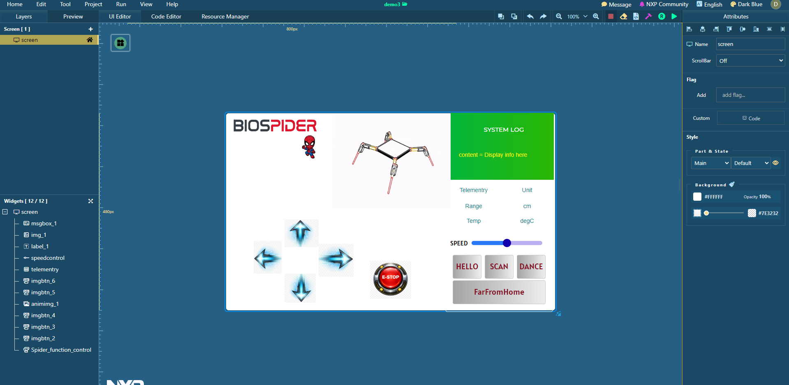

# Mini-2DOF-SPIDERobot-
This repository contains a Python simulation of gait and locomotion variables for a custom 2DOF robot(please note: friction, vibration, environment conditions in genral are ignored).

A complete cross communication system using MicroPython and Espressif C, GUI design process(graphical - not code) as well as a step-by-step tutorial on the process.

