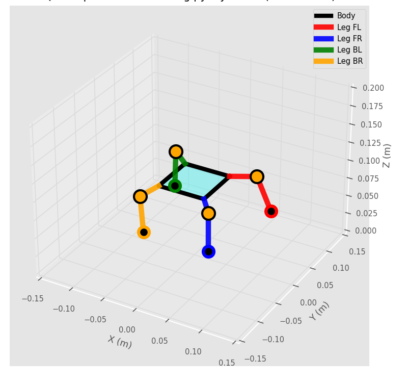
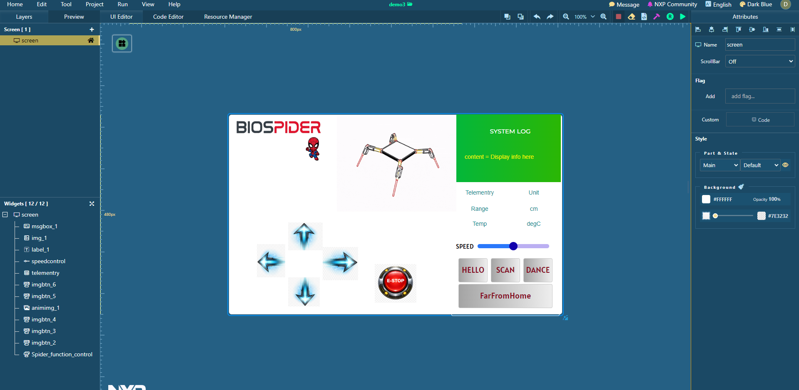

# Mini 2DOF Spider Robot

Python gait/locomotion simulation for a custom 2DOF robot with MicroPython/ESP32 cross-communication and GUI design tutorial. The simulation currently ignores friction, vibration, and environmental factors.

<video src="mainmove.mp4" autoplay loop muted playsinline width="100%"></video>
</video>

## Features

- **Gait & Locomotion Simulation** - Python-based kinematic modeling

- **Real-time Communication** - MicroPython/ESP32 ↔ PC cross-communication
- **GUI Design Tutorial** - Non-code Espressif GUI Builder setup


### Prerequisites
- **Python 3.12** with Robotics Toolbox from Peter Corke.
- **MicroPython** - ThonnyIDE
- **Espressif C / IDF extension** - Low-level control

- **NXP GUI Guider** - Interface design


---

##  Design in NXP GUI Guider - Generate code - Espressif ESP-IDF Integration


### Layer 1 — Design Tool: NXP GUI Guidera

- After finish your design, you will have the following files.
| File | Purpose |
|---|---|
| `gui_guider.h` | Central `lv_ui` struct — one named pointer per widget |
| `gui_guider.c` | `setup_ui()` entry point, animation helpers |
| `setup_scr_screen.c` | All widget creation — sizes, styles, images, fonts |
| `events_init.c/h` | Empty event stubs (generated skeletons) |
| `widgets_init.c/h` | Widget helper utilities |


### Layer 2 — implement your generated with `lv_ui` Struct

The key linking mechanism is the `lv_ui` struct in `gui_guider.h`. GUI Guider generates one named pointer per widget you placed in the designer:
My case: 
```c
typedef struct {
    lv_obj_t *screen;
    lv_obj_t *screen_Spider_function_control;  // button matrix (TROT, SCAN, MOONWALK, SPM)
    lv_obj_t *screen_imgbtn_2;    // UP arrow
    lv_obj_t *screen_imgbtn_3;    // DOWN arrow
    lv_obj_t *screen_imgbtn_4;    // LEFT arrow
    lv_obj_t *screen_imgbtn_5;    // RIGHT arrow
    lv_obj_t *screen_imgbtn_6;    // E-STOP button
    lv_obj_t *screen_telementry;  // sensor data table
    lv_obj_t *screen_speedcontrol; // speed slider
    lv_obj_t *screen_animimg_1;   // robot animation (75 frames)
} lv_ui;
```

This struct is the **contract** between GUI Guider's generated code and your hand-written logic. GUI Guider fills in the pointers inside `setup_scr_screen.c`; your application code reads them to wire up real behaviour.

---

### Layer 3 — Your Logic: `main.c` + `gui/custom/`

The `gui/custom/` folder is **never overwritten** by GUI Guider — it is your safe zone for application code:

```
gui/custom/
├── custom.c / custom.h    ← custom_init() hook called at boot
└── lv_conf_ext.h          ← LVGL config overrides
```

The boot sequence in `main.c` ties everything together:

```c
init_wifi_espnow();                              // 1. Start WiFi + ESP-NOW radio
waveshare_esp32_s3_rgb_lcd_init();               // 2. Init display hardware
setup_ui(&guider_ui);                            // 3. Run generated code → creates all widgets
wire_biospider_events_to_demo3_ui(&guider_ui);   // 4. Attach YOUR callbacks to widget pointers
create_terminal_log_widget(&guider_ui);          // 5. Add custom terminal overlay
events_init(&guider_ui);                         // 6. Generated event stubs
custom_init(&guider_ui);                         // 7. Your custom_init() hook
```

The critical step is **`wire_biospider_events_to_demo3_ui()`**, which connects generated widget handles to your ESP-NOW send functions:

```c
lv_obj_add_event_cb(ui->screen_imgbtn_2, bio_up_btn_cb,         ...); // UP    → "forward"
lv_obj_add_event_cb(ui->screen_imgbtn_3, bio_down_btn_cb,       ...); // DOWN  → "backward"
lv_obj_add_event_cb(ui->screen_imgbtn_4, bio_left_btn_cb,       ...); // LEFT  → "turn_left"
lv_obj_add_event_cb(ui->screen_imgbtn_5, bio_right_btn_cb,      ...); // RIGHT → "turn_right"
lv_obj_add_event_cb(ui->screen_imgbtn_6, bio_emergency_stop_cb, ...); // E-STOP → "STOP"
lv_obj_add_event_cb(ui->screen_speedcontrol, bio_speed_slider_cb, ...); // speed %
```

Each callback calls `bio_send_movement()` which fires `esp_now_send()` with a JSON command to the MicroPython slave:

```c
// Example: pressing UP sends this to the robot over ESP-NOW
{"cmd":"MOVE","dir":"UP","speed":75}
```

The slave (`main_espnow.py`) receives, parses, and maps it to a movement call on the `Quad` robot class.

---

## Thanks for Stopping By

This project started as a personal challenge to bridge real-time embedded C, MicroPython, and GUI design into one cohesive robot platform — and it's still evolving.

If you found something useful here — whether it's the ESP-NOW communication pattern, the LVGL integration workflow, or just the gait code — I hope it saves you some time on your own build.

**Feel free to:**
- 
- Open an issue if you spot something broken
- Fork it and make it your own

> *Build things, break things, learn things. Have a good one.* 🕷️
